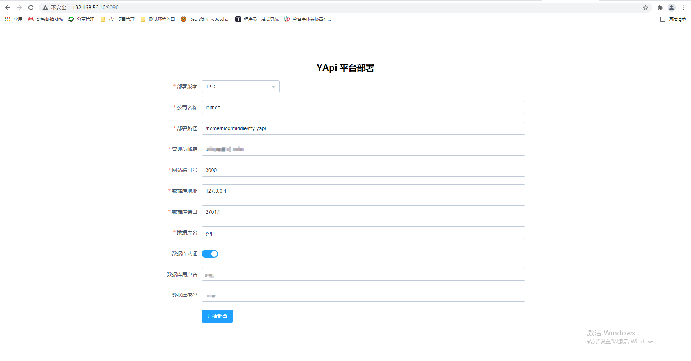

# 安装Yapi

Yapi依赖环境如下

- nodejs（7.6+)
- mongodb（2.6+）

## 依赖环境安装


### 安装NodeJS

#### 下载

打开下载路径：https://nodejs.org/en/download/releases/，选择`12.0.0`进行进入下载页，下载`node-v12.0.0-linux-x64.tar.gz `


#### 上传并解压

使用XFtp上传至服务器。解压

`tar -zxvf node-v12.0.0-linux-x64.tar.gz`

新建软件目录

`sudo mkdir -p /opt/soft` 

将解压后的文件移动至该目录下

`sudo mv node-v12.0.0-linux-x64 /opt/soft/`


#### 安装

安装有两种方式：

- 设置环境变量

```bash
$ sudo vim /etc/profile

################ 在文件最后增加如下配置 ################

# NodeJS Env
export PATH=$PATH:/opt/soft/node-v12.0.0-linux-x64/bin
```

保存后使用`source /etc/profile`使文件生效。

- 建立软链接

> 此方法便于修改node版本，更改软链接指向即可

```bash
sudo ln -s /opt/soft/node-v12.0.0-linux-x64/bin/npm /usr/local/bin/
sudo ln -s /opt/soft/node-v12.0.0-linux-x64/bin/node /usr/local/bin/
```


### 安装MongoDB

> MongoDB使用Docker进行安装


1. 查看MongoDB镜像仓库 https://hub.docker.com/_/mongo?tab=tags&page=1

2. 拉取最新版本 `docker pull mongo:latest`

3. 运行容器 `docker run -itd --name mongo -p 27017:27017 mongo --auth`，--auth表示需要需要验证密码

4. 创建用户名密码

   ```bash
   docker exec -it mongo mongo admin
   # 创建一个名为 admin，密码为 123456 的用户。
   >  db.createUser({ user:'admin',pwd:'123456',roles:[ { role:'userAdminAnyDatabase', db: 'admin'},"readWriteAnyDatabase"]});
   # 尝试使用上面创建的用户信息进行连接。
   > db.auth('admin', '123456')
   # 切换到yapi库
   > use yapi
   # 创建Yapi库的用户
   > db.createUser(  
     {  
       user: "yapi",  
       pwd: "yapi",  
       roles: [{role: "dbOwner", db: "yapi"}]  
     }  
   )
   ```


## 安装Yapi

可视化部署：

```bash
npm install -g yapi-cli --registry https://registry.npm.taobao.org
```

执行，进入到`~/middle`目录

```bash
yapi server
```


填写信息




大功告成


访问http://192.168.33.10:3000来进行登录并使用

